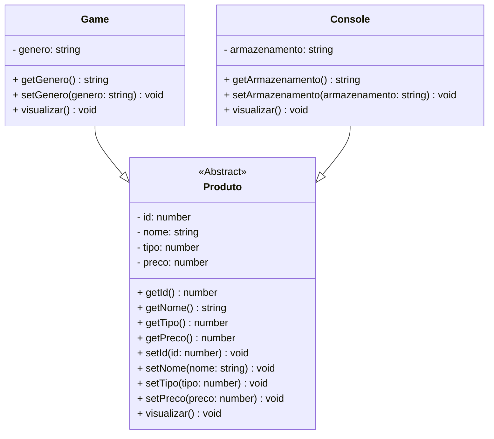

# Projeto Açougue Carne Boa - TypeScript & POO

## Sistema de Gerenciamento de E-commerce de um Açougue | Portfólio Profissional

<br />

<div align="center">
	
</div>
<br />

<div align="center">
  
  
  
  
  
  
  
</div>


------

<br />


O **Projeto Açougue Carne Boa** é uma aplicação **educacional** desenvolvida em **TypeScript**, com foco em **Programação Orientada a Objetos (POO)** e **arquitetura modular**.

**Objetivo:** Demonstrar **organização, domínio técnico, modelagem de domínio e boas práticas de engenharia de software** em um case prático de portfólio.

<br />

> [!WARNING]
>
> Este projeto possui **fins educacionais** e **não representa um e-commerce real com transações financeiras**. Foi desenvolvido para **aprendizado, demonstração técnica e portfólio profissional**.

<br />

Este projeto foi estruturado para:

- Demonstrar **competência técnica em TypeScript**
- Aplicar **POO em um cenário realista** (Herança, Abstração e Polimorfismo)
- Evidenciar **arquitetura limpa e organização de código**
- Simular **regras de negócio de um varejo de games**
- Servir como **case técnico para recrutadores**

<br />

## Competências Técnicas Demonstradas

- Programação Orientada a Objetos (Abstração, Encapsulamento, Herança, Polimorfismo)
- Modelagem de domínio orientada a objetos
- Arquitetura em camadas (**Model, Repository, Controller**)
- Tipagem forte com **TypeScript**
- Uso de **Interfaces** para contratos de repositório
- Separação de responsabilidades e tratamento de dados em Collections (Arrays)
- Validação de entradas e controle de fluxo via CLI

<br />

## Impacto Técnico e Métricas

| Indicador                     | Valor                         |
| ----------------------------- | ----------------------------- |
| Linhas de código              | +400                          |
| Classes principais            | 3 (Produto, Jogo, Console)    |
| Operações CRUD                | 5 (Criar, Listar, Buscar por ID, Atualizar, Deletar) |
| Conceitos POO aplicados       | 6+                            |
| Camadas arquiteturais         | Model, Repository, Controller |
| Persistência                  | Simulada em memória (Array)   |
| Complexidade lógica           | Média                         |
| Uso educacional               | ✅                            |

<br />

## Funcionalidades do Projeto


| Funcionalidade                     | Status |
| ---------------------------------- | ------ |
| Cadastro de Jogos e Consoles       | ✅      |
| Listagem completa de produtos      | ✅      |
| Consulta de produto por ID         | ✅      |
| Atualização de dados de produtos   | ✅      |
| Exclusão de produtos do estoque    | ✅      |
| Diferenciação por Gênero/Armazenamento | ✅      |
| Interface CLI interativa (Menu)    | ✅      |

<br />

## Diagrama de Classes




<br />

## Arquitetura do Projeto


Estrutura organizada para facilitar **manutenção, escalabilidade e leitura técnica**:

```text
📦 projeto_final_bloco_01
 ┣ 📂 src
 ┃ ┣ 📂 controller     # Implementação da lógica de negócio (ProdutoController)
 ┃ ┣ 📂 model          # Entidades (Produto, Jogo, Console)
 ┃ ┣ 📂 repository      # Interface do CRUD (ProdutoRepository)
 ┃ ┗ 📂 util           # Cores e utilitários de formatação
 ┣ 📜 Menu.ts          # Ponto de entrada (Interface com usuário)
 ┗ 📜 tsconfig.json
```

<br />

## Tecnologias Utilizadas


- **Linguagem & Runtime**

  - TypeScript

  - Node.js

  - ts-node/ readline-sync (para entrada de dados)

- **Ferramentas & Qualidade**
  - Git & GitHub
  - Mermaid (diagramas UML)
  - CLI interativa (terminal)

<br />

## Como Executar


**1️⃣ Clone o repositório**

```bash
git clone https://github.com/lucasrjesus/Projeto_final_bloco1
```

**2️⃣ Acesse a pasta do projeto via terminal**

```bash
cd projeto_final_bloco_01
```

**3️⃣ Instale as dependências**

```bash
npm install
```

**4️⃣ Execute a aplicação**

```bash
ts-node Menu.ts
```

<br />

## Implementações Futuras


- [ ]  Persistência com banco de dados
- [ ]  Testes automatizados (Jest)
- [ ]  API REST com NestJS
- [ ]  Interface Web (React)
- [ ]  Dockerização
- [ ]  CI/CD com GitHub Actions

<br />

## Contribuições


Sugestões, melhorias e pull requests são bem-vindos.

Você pode contribuir com:

- Melhorias arquiteturais
- Refatorações
- Testes automatizados
- Documentação

<br />

## Licença


Este projeto está sob licença **MIT** — livre para uso educacional e profissional.

<br />

##  Autor


**Lucas — Desenvolvedor Full Stack**

🔗 **GitHub:** https://github.com/lucasrjesus

🔗 **LinkedIn:** linkedin.com/in/lucas-jesus-972a8128a/

Projeto desenvolvido para **aprendizado contínuo**, **demonstração técnica** e **portfólio profissional**.  